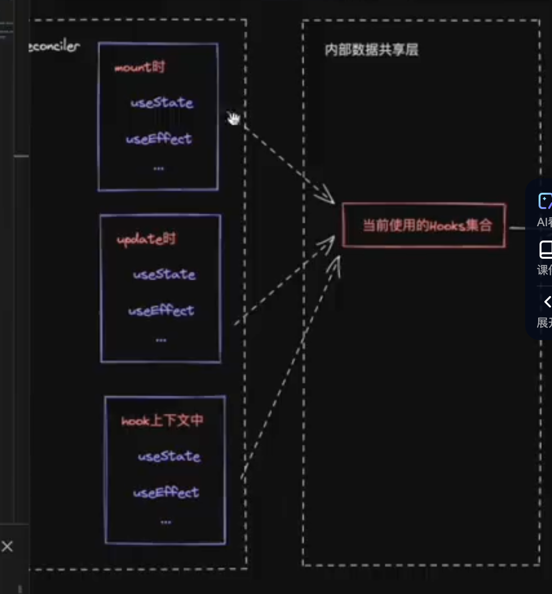
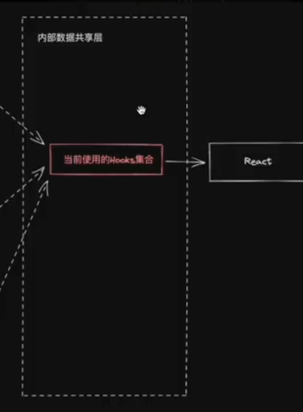
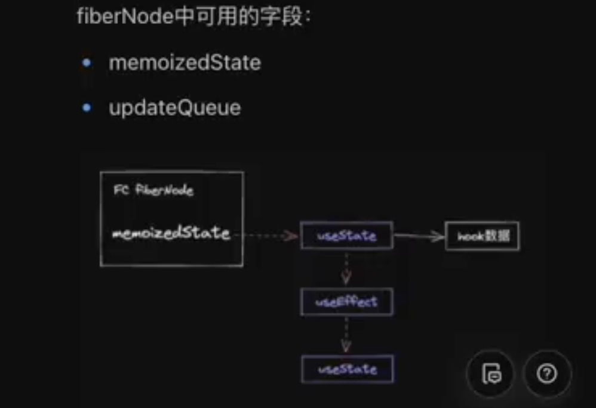
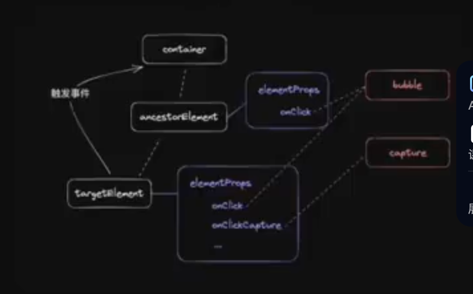

# 1.实现jsx方法
+ jsxDev方法 (dev环境)
+ jsx方法 (prod环境)
+ React.createElement方法

# 2.reconciler

jquery过程驱动 调用`宿主API`实现dom更新

UI框架状态驱动 

描述UI的方法(jsx/编译语法) ->[编译优化] 运行时核心框架(reconciler/renderer) -> 宿主API ->显示真实UI

+ 消费jsx
+ 没有编译优化(纯运行时前端框架)
+ 开放通用API供宿主环境使用

## 核心模块消费jsx过程

jsx(<div>111</div>) =>  _jsx =>(生成) ReactElement

ReactElement作为核心模块操作数据存在问题

+ 无法表达节点之间的关系
+ 字段有限，不好扩展（比如无法表达状态）
 
新的数据结构

+ 介于ReactElement与真实ui节点之间
+ 能够表达节点之间的关系
+ 方便拓展(不仅作为数据存储单元，也作为工作单元)

fiberNode 虚拟dom在React中的实现

jsx -> babel解析 -> ReactElement -> fiberNode(reconciler操作) -> Dom Element

ReactElement与fiberNode进行比较，根据比较结果生成子FiberNode
并且生成各种不同标记，对应不同宿主的API

### reconciler工作方式

对于同一个节点，比较其`ReactElement`和`FiberNode`, 生成子`FiberNode`, 并根据比较结果生成
不同标记（插入、删除、移动...），对应不同`宿主环境API`执行

当所有ReactElment比较完成后会生成一个fiberNode树，一共存在两颗fiberNode树

current 与视图中真实UI对应的fiberNode树
workInProgress 触发更新后，正在reconciler中计算的fiberNode树

** 双缓冲技术 **

jsx消费的顺序

以DFS(深度优先遍历)的顺序遍历React Element,这意味着

如果有子节点，遍历子节点
如果没有子节点，遍历兄弟节点

存在两个阶段 递和归两个阶段

递： begineWork
归： completeWork

# 如何触发更新

常见触发更新的方式
ReactDOM.createRoot().render()[ReactDOM.render()]
this.setState
useState的dispatch方法

## 更新机制的组成部分

代表更新的数据结构 -- Update
消费update的数据结构 -- UpdateQueue


+ 实现mount时调用的api
+ 将该API接入上述更新机制中
需要考虑的事情
+ 更新可能发生于任意组件，而更新流程是从根组件开始递归的
+ 需要一个统一的根节点保存通用信息

ReactDOM.createRoot(rootElement).render(<App />);


createRoot -> rootElement -> App
fiberRootNode是根节点 -> hostRootFiber -> App

在fiberReconciler中创建createContainer[创建整个应用的根节点fiberRootNode,以及hostRootFiber,并将二者连接起来]
接着实现updateContainer 将update enqueue到updateQueue中[hostRootFiber的], 将首屏渲染与触发更新的机制连接了起来

更新对应的数据结构 update
以及保存更新的数据结构 updateQueue
enqueueUpdate 将 update 插入到updateQueue中
消费update 基于基础状态 和一个pendingUpdate 经过计算得到memorizedState

插入后就实现scheduleUpdateOnFiber,开始调度

从当前更新的fiber一直更新到fiberRootNode,接着执行renderRoot

在renderRoot中首先初始化prepareFreshStack,在其中生成hostRootFiber对应的workInProgress

之后进行workLoop流程


// React中存在两棵树
// 一个是当前dom的树 fiberRootNode的current可以访问到
// 一个是正在更新过程构建的树，称为workInProgress fiber node
更新完成后 fiberRootNode的current会指向wip的树

# 初探Mount流程(首屏渲染更新流程)

更新流程的目的

+ 生成wip的树
+ 标记副作用flags

更新流程的过程
+ 递 beginWrok
+ 归 completeWork


# begineWork
<A>
    <B/>
</A>

通过对比B的ReactElement和fiberNode生成wip fibernode

此过程设计两类与[结构变化]相关的flags
+ Placement
插入 移动
+ ChildDeletion
删除

不包含与[属性相关]的flags
+ Update


@rollup/plugin-replace去替换alias

HostRoot的begineWork的工作流程
1. 计算状态的最新值
2. 创造子fiberNode

HostComponent的begineWork工走流程
1. 创造子fiberNode

HostText没有子节点,所以没有begineWork工作流程

begineWork性能优化 离屏dom树 多次placement可以合并成一次执行

### completeWork
需要解决的问题：
+ 对于Host类型的fiberNode: 构建离屏dom树
+ 标记UpdateFlag (TODO)

性能优化策略

flags分布在不同的dom树中，如何快速找到

答：利用completeWork向上遍历的过程，将子fiberNode的flags冒泡到父fiberNode

### 初探ReactDOM

react 内部三个阶段
+ schedule阶段 调度阶段主要做的是更新
+ render阶段 (begineWork completeWork) 处理更新阶段
+ commit阶段（commiWork阶段）根据flags执行宿主环境的操作

commit阶段3个子阶段
+ beforeMutation阶段
+ mutation节点 突变 将一个值变为另一个值
+ layout阶段 useLayoutEffect这个hooks在这时候执行

当前commit阶段要执行的任务
1. fiber树切换
2. 执行placement对应操作 

ReactDOM包
1. 兼容原版
2. hostConfig的指向

# FC与实现

FunctionComponent需考虑的问题
+ 如何支持FC
+ 如果支持hooks

FC同样基于
+ begineWork
+ completeWork

vite调试实时看到源码

# 实现useState

hook是不能脱离FC上下文，仅仅是普通函数。如何让它有感知上下文环境的能力

比如说：
hook如何知道在另一个上下文环境内执行

```js
function App() {
    useEffect(() => {
        useState(2);
    })
}
```

hook怎么知道当前是mount还是update

在不同上下文中调用的hook不是同一个




hook如何知道自身数据保存在哪里

```js
function App() {
    const [num] = useState(0);
}
```

可以记录当前正在render的FC对应的fiberNode,在fiberNode中保存hook数据

### 实现hooks的数据结构
fiberNode中可用的数据结构
+ memorizedState
+ updateQueue



hook在调用过程中顺序不能变，因为hook采用链表保存数据

对于Fc对应的fiberNode，存在两层数据
+ fiberNode.memorizedState对应Hooks链表
+ 链表中每个Hook对应自身的数据

### 实现useState
包括两方面工作
1. 实现mount时useState的实现
2. 实现dispatch方法，并接入现有更新流程中

# 初谈Update流程

对于begineWork:
+ 需要处理childDeletion的情况
+ 需要处理节点移动的情况（abc -> bca）
对于completeWork:
+ 需要处理HostText内容更新的情况
+ 需要处理HostComponent属性变化的情况
对于commitWork:
+ 对于childDeletion 需要遍历被删除的子树
对于useState
+ 实现相对于mountState的updateState

## begineWork
本节课仅处理单一节点，所以省去了节点移动的情况，我们需要处理
+ singleElement
+ singleTextNode
处理流程为：
1. 比较是否可以复用current fiber
a 比较key，如果key不同，不能复用
b 比较type,如果type不同，不能复用
c 如果key与type相同，则可以复用
2. 不能复用，则创建新的（同mount流程）,可以复用则复用旧的旧的

注意：对于同一个fiberNode,即使反复更新，current,wip这两个fiberNode会重复使用

## completeWork
主要处理[标记Update]的情况，本节课我们处理HostText内容更新的情况

## commitWork流程

对于标记ChildDeletion的子树，由于子树中
+ 对于FC,需要处理useEffect unmount执行，解绑ref
+ 对于HostComponent,需要解绑ref
+ 对于子树的[根HostComponent] 需要移除dom
所以需要实现【遍历childDeletion子树】的流程

## 对于useState
需要实现：
+ 针对update时的dispatcher
+ 实现对标mountWorkInProgressHook的updateWorkInProgressHook
+ 实现updateState中[计算新state的逻辑]

其中updateWorkInProgressHook的实现需要考虑的问题
+ hook数据从哪里来
+ 交互阶段触发的更新 button的onClick
+ render阶段触发的更新
```js
function App() {
    const [num, useNum] = useState(10);
    useNum(100)

    return (
        <div>{num}</div>
    )
}
```
 
# 实现事件系统

事件系统本质上植根于浏览器事件模型，所以他隶属于ReactDOM,在实现时要做到Reconciler 0侵入

实现事件系统需要考虑：
+ 模拟实现浏览器事件捕获、冒泡流程
+ 实现合成事件对象
+ 方便后续扩展

实现ReactDOM与Reconciler对接

将事件回调保存在DOM中，通过以下两个时机对接：
+ 创建DOM时
+ 更新属性时

# 模拟实现浏览器事件流程

需要注意的点
+ 基于事件对象实现合成事件，以满足自定义需求（比如：阻止事件传递）
+ 方便后续扩展优先级机制

# Diff
对于同级多节点Diff的支持
单节点需要支持的情况：
+ 插入Placement
+ 删除ChildDeletion

多节点需要支持的情况：
+ 插入Placement
+ 删除ChildDeletion
+ 移动Placement

整体流程分为4步
1. 将current中所有同级fiber保存到Map中
2. 遍历newChild数组，对于每个遍历到的element,存在两种情况
a. 在Map中存在对应的currentFiber, 且可以复用
b. 在Map中不存在对应的currentFiber, 或不能复用 ( key相同，tag也相同)
3. 判断是插入还是移动
4. 最后map中标记的都删除

步骤2 -- 是否复用详解
首先，根据key从Map中获取current Fiber,如果不存在current Fiber,则没有复用的可能

接下来，分情况讨论：
+ element是HostText, current Fiber是么
+ element是其他ReactElement, current Fiber是么
+ TODO element是数组或Fragment, current Fiber是么