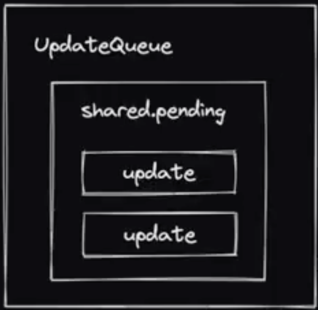
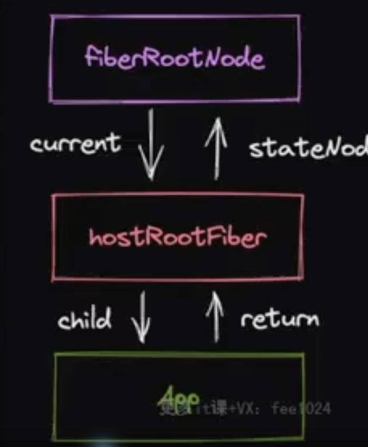

# 1.实现jsx方法
+ jsxDev方法 (dev环境)
+ jsx方法 (prod环境)
+ React.createElement方法

# 2.reconciler

jquery过程驱动 调用`宿主API`实现dom更新

UI框架状态驱动 

描述UI的方法(jsx/编译语法) ->[编译优化] 运行时核心框架(reconciler/renderer) -> 宿主API ->显示真实UI

+ 消费jsx
+ 没有编译优化(纯运行时前端框架)
+ 开放通用API供宿主环境使用

## 核心模块消费jsx过程

jsx(
111
) =>  _jsx =>(生成) ReactElement

ReactElement作为核心模块操作数据存在问题

+ 无法表达节点之间的关系
+ 字段有限，不好扩展（比如无法表达状态）
 
新的数据结构

+ 介于ReactElement与真实ui节点之间
+ 能够表达节点之间的关系
+ 方便拓展(不仅作为数据存储单元，也作为工作单元)

fiberNode 虚拟dom在React中的实现

jsx -> babel解析 -> ReactElement -> fiberNode(reconciler操作) -> Dom Element

ReactElement与fiberNode进行比较，根据比较结果生成子FiberNode
并且生成各种不同标记，对应不同宿主的API

### reconciler工作方式

对于同一个节点，比较其`ReactElement`和`FiberNode`, 生成子`FiberNode`, 并根据比较结果生成
不同标记（插入、删除、移动...），对应不同`宿主环境API`执行

当所有ReactElment比较完成后会生成一个fiberNode树，一共存在两颗fiberNode树

current 与视图中真实UI对应的fiberNode树
workInProgress 触发更新后，正在reconciler中计算的fiberNode树

** 双缓冲技术 **

jsx消费的顺序

以DFS(深度优先遍历)的顺序遍历React Element,这意味着

如果有子节点，遍历子节点
如果没有子节点，遍历兄弟节点

存在两个阶段 递和归两个阶段

递： begineWork
归： completeWork

# 如何触发更新

常见触发更新的方式
ReactDOM.createRoot().render()[ReactDOM.render()]
this.setState
useState的dispatch方法

## 更新机制的组成部分

代表更新的数据结构 -- Update
消费update的数据结构 -- UpdateQueue

+ 实现mount时调用的api
+ 将该API接入上述更新机制中
需要考虑的事情
+ 更新可能发生于任意组件，而更新流程是从根组件开始递归的
+ 需要一个统一的根节点保存通用信息

ReactDOM.createRoot(rootElement).render(<App />);

createRoot -> rootElement -> App
fiberRootNode是根节点 -> hostRootFiber -> App

在fiberReconciler中创建createContainer[创建整个应用的根节点fiberRootNode,以及hostRootFiber,并将二者连接起来]
接着实现updateContainer 将update enqueue到updateQueue中[hostRootFiber的], 将首屏渲染与触发更新的机制连接了起来

更新对应的数据结构 update
以及保存更新的数据结构 updateQueue
enqueueUpdate 将 update 插入到updateQueue中
消费update 基于基础状态 和一个pendingUpdate 经过计算得到memorizedState

插入后就实现scheduleUpdateOnFiber,开始调度

从当前更新的fiber一直更新到fiberRootNode,接着执行renderRoot

在renderRoot中首先初始化prepareFreshStack,在其中生成hostRootFiber对应的workInProgress

之后进行workLoop流程

// React中存在两棵树
// 一个是当前dom的树 fiberRootNode的current可以访问到
// 一个是正在更新过程构建的树，称为workInProgress fiber node
更新完成后 fiberRootNode的current会指向wip的树

# 初探Mount流程(首屏渲染更新流程)

更新流程的目的

+ 生成wip的树
+ 标记副作用flags

更新流程的过程
+ 递 beginWrok
+ 归 completeWork

# begineWork
<A>
    <B/>
</A>

通过对比B的ReactElement和fiberNode生成wip fibernode

此过程设计两类与[结构变化]相关的flags
+ Placement
插入 移动
+ ChildDeletion
删除

不包含与[属性相关]的flags
+ Update

@rollup/plugin-replace去替换alias

HostRoot的begineWork的工作流程
1. 计算状态的最新值
2. 创造子fiberNode

HostComponent的begineWork工走流程
1. 创造子fiberNode

HostText没有子节点,所以没有begineWork工作流程

begineWork性能优化 离屏dom树 多次placement可以合并成一次执行

### completeWork
需要解决的问题：
+ 对于Host类型的fiberNode: 构建离屏dom树
+ 标记UpdateFlag (TODO)

性能优化策略

flags分布在不同的dom树中，如何快速找到

答：利用completeWork向上遍历的过程，将子fiberNode的flags冒泡到父fiberNode

### 初探ReactDOM

react 内部三个阶段
+ schedule阶段
+ render阶段 (begineWork completeWork)
+ commit阶段（commiWork阶段）

commit阶段3个子阶段
+ beforeMutation阶段
+ mutation节点 突变 将一个值变为另一个值
+ layout阶段 useLayoutEffect这个hooks在这时候执行

当前commit阶段要执行的任务
1. fiber树切换
2. 执行placement对应操作 

ReactDOM包
1. 兼容原版
2. hostConfig的指向